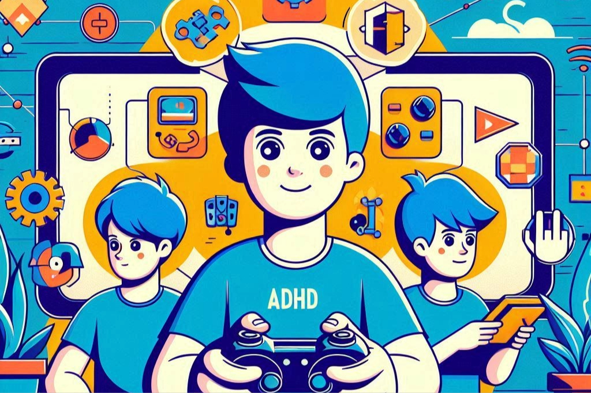

# ADHDventure

ADHDventure es una plataforma de juegos interactivos orientada a personas con TDAH (Trastorno por Déficit de Atención e Hiperactividad) 

1. [Idea](#idea-idea)
2. [Audiencia objetivo](#)
3. [Análisis de mercado](#)
4. [Funcionalidades clave](#)
5. [Lenguajes de programación web](#)
6. [Tecnologías a utilizar](#)
7. [Compatibilidad en navegadores](#)

---
# Idea {#idea}

La idea de ADHDventure es ofrecer una serie de retos y juegos interactivos para  