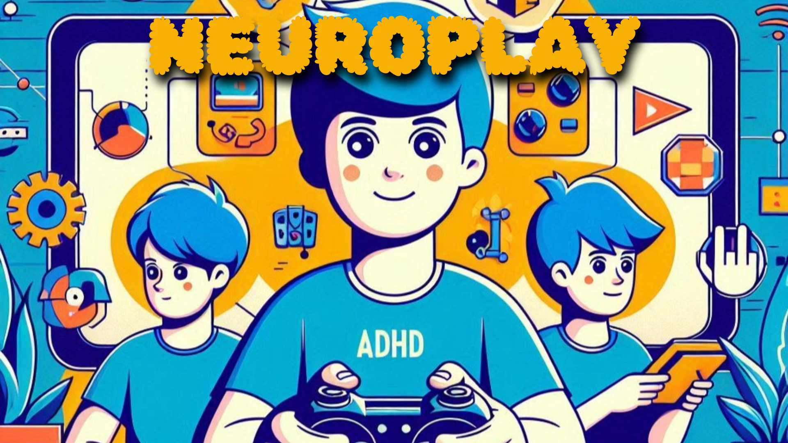

 

# Informe técnico  

|  | NeuroPlay  es una plataforma de juegos interactivos orientada a personas con TDAH (Trastorno por Déficit de Atención e Hiperactividad)  |
| ----------- | ----------- |

1. [Modelos de ejecución](#modelos-de-ejecución)
2. [Lenguajes de programación web](#lenguajes-de-programación-web)
3. [Compatibilidad en navegadores](#compatibilidad)
4. [Mecanísmos de integración](#mecanísmos-de-integración)
5. [Evaluación de herramientas de programación](#evaluación-de-herramientas-de-programación--cliente-)
---
6. [Bibliografía](#bibliografía)

## Modelos de ejecución

En el modelo de ejecución en cliente, las operaciones y la lógica del juego se ejecutan directamente en el navegador del usuario. Este modelo es ideal para la parte interactiva y visual de los juegos, ya que proporciona una respuesta rápida y fluida sin depender constantemente del servidor.

En el modelo de ejecución en servidor, las operaciones se realizan en el servidor y luego los resultados se envían al cliente. Esto es más adecuado para el almacenamiento de perfiles de usuarios, las recompensas, el progreso y las estadísticas, ya que requiere seguridad y persistencia de datos.

> Un ejemplo claro es usar el modelo de cliente para la lógica de los juegos y el modelo de servidor para la autenticación y gestión de datos de usuarios.

## Lenguajes de programación web

JavaScript: Es el lenguaje más utilizado en el lado del cliente, permitiendo interactividad en tiempo real en los juegos. Ventajas: Gran compatibilidad con navegadores, velocidad y capacidad de crear experiencias interactivas complejas. Desventajas: Puede ser difícil de depurar en aplicaciones muy grandes y puede requerir bibliotecas adicionales.

TypeScript: Una extensión de JavaScript que añade tipado estático. Ventajas: Mayor robustez y detección de errores en tiempo de desarrollo, especialmente útil en proyectos grandes. Desventajas: Mayor curva de aprendizaje comparada con JavaScript puro, y requiere compilación.

## Compatibilidad 

Impacto en la elección de tecnologías
La elección de las tecnologías para el desarrollo web debe tener en cuenta los problemas de compatibilidad para garantizar una experiencia de usuario fluida en todos los navegadores. Aquí hay algunas consideraciones:

### Frontend (React):

React es altamente compatible con los navegadores modernos. Sin embargo, si se necesita soporte para navegadores antiguos (como IE11), será necesario incluir polyfills para garantizar que características modernas como **Promesas, Fetch API, y ciertas funciones de ES6+ sean compatibles.**
Herramientas como [**Babel**](https://cli.vuejs.org/guide/browser-compatibility.html) son esenciales para transpilar el código moderno a versiones de JavaScript compatibles con todos los navegadores.

### Backend (Laravel):

Laravel no tiene problemas directos con la compatibilidad en navegadores, ya que son tecnologías de backend. Sin embargo, para la **comunicación frontend-backend**, la elección de cómo se gestionan las APIs (REST o GraphQL) y las conexiones puede verse afectada por problemas de compatibilidad de las APIs de JavaScript en el cliente. Asegurarse de que las llamadas a las **APIs** se manejen correctamente (con soporte para [CORS](https://developer.mozilla.org/en-US/docs/Learn/Tools_and_testing/Cross_browser_testing/Introduction) , entre otros) es importante para evitar errores en ciertos navegadores.
Librerías y frameworks complementarios:

Herramientas como **Webpack** permiten optimizar el código para diferentes navegadores, minimizando el tamaño y ajustando el código según la compatibilidad del navegador. **Webpack** puede generar múltiples archivos adaptados a distintos navegadores, asegurando que se cargue el más óptimo para cada uno.
Uso de tecnologías progresivas:

Dado que tecnologías como **Service Workers y PWA** pueden no estar completamente soportadas en todos los navegadores, es clave implementar **detección progresiva** para cargar funcionalidades avanzadas solo cuando el navegador lo soporte. Esto asegura que la aplicación funcione sin problemas incluso si ciertas características no están disponibles.

> *En resumen:* 
>
> *Es importante tener en cuenta que algunas funciones modernas como fetch api, algo esencial para la comunicación del frontend-backend sean adaptadas con tecnologías que permitan la compatibilidad con navegadores más antiguos o no compatibles. Es clave tener en cuenta a todo el público y tecnologías posibles para mayor rango de usuarios.*

## Mecanísmos de integración

En **React**, que es el caso que yo voy a usar para mi aplicación ( detallado la valoración más abajo ), se establece en el index.html ubicado en la carpeta `/public` mediante el uso del div con id #root es que comunicamos el index.html con el index.js mediante `document.getElementById('root')` Esta conexión se facilita mediante `ReactDOM.render()` que permite a React la inyección de componentes de forma dinamica y administración de la interfaz.

> En vue es exactamente igual.

## Evaluación de herramientas de programación ( cliente )
### React:

- Ventajas:
Componentización avanzada y reutilizable, lo que lo hace ideal para aplicaciones con muchas interacciones o necesidades de rendimiento específicas.
Amplio ecosistema de librerías y herramientas, ideal si planeas agregar funcionalidades avanzadas como renderizado del lado del servidor o PWA (Progressive Web Apps).
Se adapta muy bien a proyectos que podrían crecer o escalar en el futuro.
- Desventajas:
Más complejidad inicial si no tienes experiencia previa.
Se requiere la integración de librerías adicionales (como Redux para el manejo de estados), lo que puede aumentar el tiempo de desarrollo.
### Vue.js:

- Ventajas:
Curva de aprendizaje más rápida en comparación con React, lo que te permite comenzar a desarrollar más rápidamente.
Manejo de estado más simple sin la necesidad de bibliotecas externas como Redux.
Simplicidad y ligereza: Vue es más ligero que React, lo que lo hace ideal para proyectos que priorizan la velocidad y la facilidad de mantenimiento.
- Desventajas:
React tiene un ecosistema más amplio y podría ser más flexible si en el futuro necesitas expandir la aplicación a funcionalidades más complejas.

## Bibliografía

1. Aquí busqué información acerca de ventajas y desventajas de Javascript y Typescript -> [Haz click aquí](https://www.campusmvp.es/recursos/post/typescript-contra-javascript-cual-deberias-utilizar.aspx)
2. cors -> [Haz click aquí](https://developer.mozilla.org/en-US/docs/Learn/Tools_and_testing/Cross_browser_testing/Introduction)
3. cors -> [Haz clic aquí](https://blog.pixelfreestudio.com/how-to-ensure-cross-browser-compatibility-with-react-applications/)
4. Bable -> [Haz click aquí](https://cli.vuejs.org/guide/browser-compatibility.html)